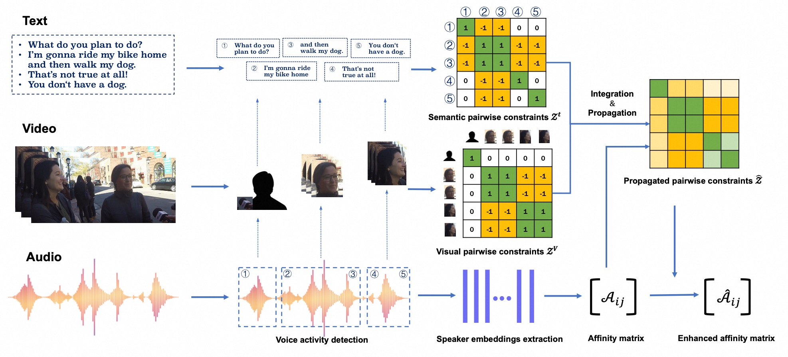

# multimodal_pairwise_constrained_speaker_diarization
MultiModal Pairwise Constrained Speaker Diarization System

This is the official implementation of paper "Integrating Audio, Visual, and Semantic Information for Enhanced Multimodal Speaker Diarization on Multi-party Conversation".

## Framework

1. Some **core pairwise constrained clustering** code in our solution has been published in `src` directory.
2. Regarding the open source of the data part, we are doing the final review, and we will give the complete process scripts after the data is open source.
3. Part of the visual and semantic modules have been published in our team's toolkit [3d-speaker-toolkits](https://github.com/modelscope/3D-Speaker), which you can refer to.
